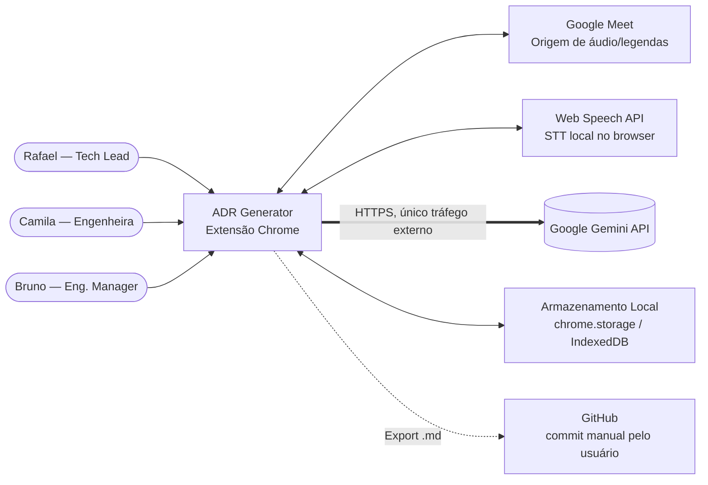
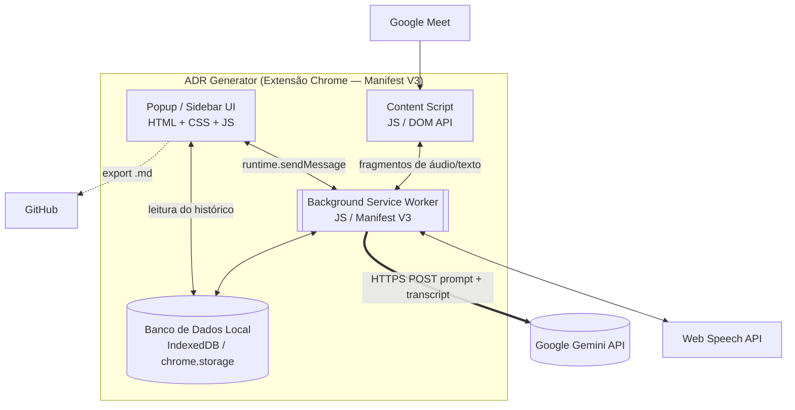
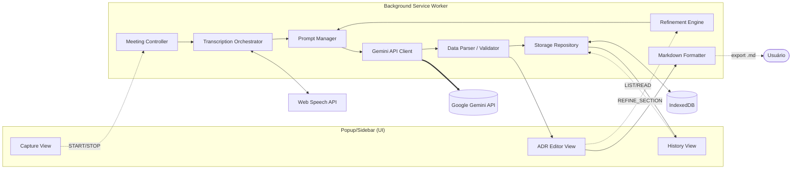

# Modelo C4 — ADR Generator
## Extensão para Google Meet (MVP)

> Artefato da fase **Ensaio** da metodologia [Sinfonia](https://github.com/assertlab/sinfonia), construído sobre o template `C4_Model_Canvas_Template.md` (3 níveis: Contexto, Contêiner, Componente).
> Objetivo: documentar a arquitetura técnica do MVP em três níveis de abstração, do propósito do sistema até o detalhe dos componentes internos, fornecendo base para os artefatos subsequentes da fase de Ensaio (Intelligence Strategy Record, Análise de Riscos, Testes e Validação).

---

## Visão Geral

O **ADR Generator** é uma **extensão Chrome (Manifest V3)** que, durante uma reunião no Google Meet, captura a transcrição via Web Speech API, submete o conteúdo à **Google Gemini API** com o prompt CoT + Few-Shot definido em [`prompt_design_record.md`](../02_composicao/prompt_design_record.md) e devolve um **ADR estruturado** (padrão Michael Nygard) editável e exportável em Markdown — tudo com **persistência local** no navegador, sem backend próprio.

A solução priorizada para prototipagem foi definida no [`canvas_ideacao_solucao.md`](../02_composicao/canvas_ideacao_solucao.md) §4 (Ideia A + Ideia G) e validada experimentalmente no [`canvas_design_experimentos.md`](../02_composicao/canvas_design_experimentos.md) (Experimento 1, transcrição real de ~35K caracteres).

---

## Nível 1 — Diagrama de Contexto

**Título:** Diagrama de Contexto para o ADR Generator.
**Descrição:** Mostra os atores externos (engenheiros de software em diferentes papéis) e os sistemas/serviços externos com os quais a extensão interage, sem detalhar o interior do produto.

### Atores (Pessoas)

Personas definidas em [`canvas_personas.md`](../01_exposicao/canvas_personas.md):

| Persona | Papel | Como usa o ADR Generator |
|---|---|---|
| **Rafael** | Tech Lead | Lidera decisões arquiteturais; inicia/para a captura, refina seções, exporta o `.md` para versionamento no GitHub. |
| **Camila** | Engenheira de Software | Participa das reuniões e edita campos do ADR gerado para refletir fielmente a discussão antes do export. |
| **Bruno** | Engineering Manager | Consulta o histórico local de ADRs em onboardings e auditorias para garantir rastreabilidade do rationale. |

### Sistema Principal

- **ADR Generator (Software System)** — extensão Chrome Manifest V3 instalada localmente, executada no contexto do navegador do usuário durante reuniões do Google Meet.

### Sistemas Externos

| Sistema externo | Papel no fluxo | Direção | Tipo de tráfego |
|---|---|---|---|
| **Google Meet** | Origem do áudio/legendas da reunião. | ADR Generator → Meet (leitura) | DOM/áudio local (sem rede). |
| **Web Speech API** (browser) | Converte fala em texto (STT) localmente no navegador. | ADR Generator ↔ Web Speech API | Local, sem rede externa. |
| **Google Gemini API** | Gera o ADR estruturado a partir da transcrição (única dependência de rede externa). | ADR Generator → Gemini (HTTPS) | Trecho de transcrição + prompt; até 30K caracteres por sessão (ver `canvas_mapeamento_fontes_dados.md` Fonte 1). |
| **Armazenamento Local do Navegador** (`chrome.storage.local` / IndexedDB) | Persiste histórico de ADRs e preferências do usuário. | ADR Generator ↔ Storage | Local. |
| **GitHub** (opcional, ação do usuário) | Repositório onde o `.md` exportado é versionado por ação manual do engenheiro. | Usuário → GitHub (fora da extensão) | HTTPS via cliente git/UI do GitHub. |

### Interações (Fluxos Principais)

1. **Camila/Rafael** iniciam a captura de uma reunião ativa do **Google Meet** através do botão da extensão.
2. A extensão consome áudio/legendas do **Google Meet** e aciona a **Web Speech API** para obter a transcrição em texto.
3. Ao final da reunião, a transcrição acumulada é enviada à **Google Gemini API** junto do prompt CoT + Few-Shot; a API responde com um JSON estruturado seguindo o `responseSchema` documentado em [`prompt_design_record.md`](../02_composicao/prompt_design_record.md) §2.
4. O ADR é apresentado na UI da extensão, onde **Camila/Rafael** editam campos e podem disparar refinamentos por seção (Ideia G).
5. O ADR aprovado é persistido no **Armazenamento Local** e exportado como `.md` para commit manual no **GitHub** pelo engenheiro.
6. **Bruno** consulta o histórico no Armazenamento Local pela UI da extensão para auditoria e onboarding.

### Legenda

- **Linhas sólidas** = interações automáticas executadas pela extensão.
- **Linhas tracejadas** = interações executadas manualmente pelo usuário (export e commit).
- **Sistemas com borda dupla** (Gemini API) = único ponto de tráfego de dados externos da arquitetura — relevante para o canvas de riscos de IA (LGPD, vendor lock-in).

### Diagrama (Mermaid)

---

## Nível 2 — Diagrama de Contêineres

**Título:** Diagrama de Contêineres para o ADR Generator.
**Descrição:** Detalha a estrutura interna da extensão Chrome, suas peças constituintes (containers) e como cada uma se comunica com as demais e com os sistemas externos do Nível 1.

### Contêineres da Solução

| # | Contêiner | Tecnologia | Responsabilidade |
|---|---|---|---|
| 1 | **Content Script** *(injected script)* | JavaScript / DOM API / `chrome.scripting` | Injetado no domínio `meet.google.com`. Captura o stream de áudio/legendas diretamente do DOM da reunião e repassa ao Background Service. |
| 2 | **Popup / Sidebar (UI)** | HTML + CSS + JS (vanilla ou React) | Interface gráfica do usuário: controle (`START/STOP`), exibição do rascunho do ADR, edição inline, refinamento por seção, navegação no histórico, export `.md`. |
| 3 | **Background Service Worker** | JavaScript / Manifest V3 Service Worker | Núcleo da extensão. Orquestra capturas, chamadas à Web Speech API e à Gemini, monta o prompt e gerencia o estado da sessão. Único contêiner com permissão para tráfego HTTPS externo. |
| 4 | **Banco de Dados Local** | IndexedDB API / `chrome.storage.local` | Persiste ADRs gerados, transcrições temporárias da sessão corrente e configurações (API key do usuário, preferências). |

### Interações entre Contêineres

- **Popup/Sidebar ↔ Background Service Worker:** comunicação via `chrome.runtime.sendMessage` / `onMessage`. A UI envia comandos (`START_CAPTURE`, `STOP_CAPTURE`, `GENERATE_ADR`, `REFINE_SECTION`) e recebe eventos (`TRANSCRIPT_UPDATED`, `ADR_READY`, `ERROR`).
- **Content Script ↔ Background Service Worker:** mensagens com fragmentos de áudio/transcrição capturados do DOM do Meet.
- **Background Service Worker ↔ Web Speech API:** captura local, sem rede externa.
- **Background Service Worker → Google Gemini API:** `fetch` HTTPS POST com `prompt + transcrição` (até 30K chars) + `responseSchema`; recebe JSON estruturado.
- **Background Service Worker ↔ Banco de Dados Local:** operações CRUD em IndexedDB para persistir e recuperar histórico.
- **Popup/Sidebar → Banco de Dados Local:** leitura direta opcional para a tela de histórico (alternativamente via Background).
- **Popup/Sidebar → Usuário → GitHub:** export do `.md` finalizado, commit manual fora da extensão.

### Legenda

- **Contêineres com borda dupla** (Background Service Worker) = únicos com permissão de rede externa.
- **Setas bidirecionais** = canais de mensagens (`runtime.sendMessage`).
- **Setas unidirecionais** = fluxos de dados ou comandos com sentido único na operação cotidiana.

### Diagrama (Mermaid)

---

## Nível 3 — Diagrama de Componentes

**Título:** Diagrama de Componentes para o Background Service Worker e a UI do ADR Generator.
**Descrição:** Detalha como o **Background Service Worker** (contêiner #3) e a **Popup/Sidebar UI** (contêiner #2) — os dois com mais lógica — estão internamente decompostos.

### Componentes Internos

| Componente | Contêiner | Tecnologia | Responsabilidade |
|---|---|---|---|
| **Meeting Controller** | Background | JS / Chrome Runtime API / `chrome.tabs` | Gerencia comandos de início/parada de captura. Identifica abas do Google Meet ativas e dispara o Content Script. |
| **Transcription Orchestrator** | Background | JS async / Message Passing | Recebe fragmentos do Content Script, faz a ponte com a Web Speech API e acumula a transcrição da sessão até o cap de 30K caracteres (ver `canvas_mapeamento_fontes_dados.md` Fonte 1). |
| **Prompt Manager** | Background | JS / Template Literals | Estrutura a engenharia de prompts: monta `systemInstruction` + `userPrompt` conforme [`prompt_design_record.md`](../02_composicao/prompt_design_record.md) §2, injetando a transcrição e os exemplos de few-shot. |
| **Gemini API Client** | Background | Fetch API / HTTPS | Encapsula chamadas POST HTTPS à Google Gemini API (`gemini-3-flash-preview`, `temperature: 0`, `responseMimeType: "application/json"`, `responseSchema` forçado). Trata `429`/`5xx` com retry e backoff. |
| **Data Parser / Validator** | Background | `JSON.parse` / validação por chaves | Recebe a string JSON da Gemini, faz `parse`, valida presença dos 8 campos obrigatórios do schema do ADR e marca o objeto como `ready` ou `invalid` antes de devolver à UI. |
| **Refinement Engine** | Background | JS / reuso de Prompt Manager | Suporta a Ideia G (refinamento por seção): regenera apenas o campo selecionado pelo usuário, mantendo o restante intacto. Reusa Prompt Manager + Gemini Client. |
| **Storage Repository** | Background | IndexedDB API | Camada única de acesso ao Banco de Dados Local. Operações `save`, `list`, `get`, `delete` e `update` de ADRs; isola a UI dos detalhes do IndexedDB. |
| **Markdown Formatter** | Background ou UI | JS / String Manipulation | Converte o objeto JSON validado em Markdown segundo o padrão Michael Nygard (cabeçalhos, listas, blocos), preparando o conteúdo para download `.md`. |
| **Recording Overlay** | Content Script | JS / Shadow DOM | Box de preview injetado na página do Meet enquanto a captura está ativa: ponto pulsante, cronômetro + horário de início, últimas linhas de legenda e botão "Encerrar" (com confirmação) que dispara `STOP_CAPTURE` ao SW. Recebe `CAPTURE_TRUNCATED` para avisar do cap de 30K. Isolado por Shadow DOM contra o CSS do Meet. |
| **Capture View** | UI (popup) | HTML/JS | Tela de controle da captura: botões `START/STOP`, indicador de tempo decorrido, contador de caracteres, botão "Revisar transcrição (tela cheia)" e aviso de cap atingido. |
| **Full-page (Page)** | UI (aba) | HTML/JS | Página de extensão dedicada aberta em aba (`chrome.tabs.create`), tira o Editor e a revisão do popup estreito. Roteia por query: `?view=editor&id` (busca via `GET_ADR`, reusa o ADR Editor View) e `?view=review` (revisão da transcrição em textarea de tela cheia — modo redação P2). |
| **ADR Editor View** | UI | HTML/JS | Edição do ADR gerado (campos por chave do schema, refinamento por seção). **Banner persistente "Gerado por IA / Revisado"** (T1); export `.md` liberado só após "Marcar como revisado", com o flag `reviewed` persistido no registro (F1). Renderizado dentro da Full-page. |
| **History View** | UI (popup) | HTML/JS | Listagem do histórico local, busca por título, abertura de ADRs (na aba do Editor) e export `.md` inline **gated** pelo flag `reviewed`. |
| **Settings View** | UI | HTML/JS | Aba de configurações dentro do popup: chave da Gemini API (`storage.session`) e "Apagar todos os dados" (reset total, type-to-confirm). |

### Fluxos Internos (Geração de um ADR ponta-a-ponta)

1. **Capture View** envia `START_CAPTURE` ao **Meeting Controller**, que injeta o Content Script na aba do Meet.
2. **Content Script** repassa fragmentos de áudio ao **Transcription Orchestrator**, que aciona a **Web Speech API** e acumula a transcrição.
3. Usuário clica em `STOP_CAPTURE`; o **Transcription Orchestrator** entrega a transcrição consolidada ao **Prompt Manager**.
4. **Prompt Manager** monta o pacote `{systemInstruction, userPrompt, responseSchema, generationConfig}` e entrega ao **Gemini API Client**.
5. **Gemini API Client** envia POST HTTPS à Google Gemini API e recebe a resposta como string JSON.
6. **Data Parser / Validator** faz `JSON.parse`, valida campos obrigatórios; se inválido, sinaliza erro para a UI; se válido, segue ao próximo passo.
7. **Storage Repository** persiste o ADR validado no IndexedDB.
8. **ADR Editor View** renderiza os campos para edição; o usuário pode editar texto inline ou disparar refinamento por seção.
9. Em refinamento, **Refinement Engine** monta novo prompt restrito ao campo alvo e repete o ciclo apenas para esse campo.
10. **Markdown Formatter** converte a versão aprovada em `.md` e o usuário baixa o arquivo para commit manual no **GitHub**.

### Legenda

- **Componentes em itálico no contêiner Background** = lógica orquestradora central; nenhum componente da UI fala diretamente com a Gemini API.
- **Setas pontilhadas** = comunicação via `chrome.runtime.sendMessage` entre UI e Background.
- **Setas sólidas** = chamadas de função internas ao mesmo contêiner.

### Diagrama (Mermaid)

---

## Decisões Arquiteturais Implícitas

Estas decisões emergem do C4 acima e ficarão registradas com mais profundidade nos artefatos seguintes da fase de Ensaio (Intelligence Strategy Record, Análise de Riscos):

1. **Zero backend** — toda lógica vive no navegador do usuário. Justificativa: aderência LGPD por design, viabilidade em 1 mês, custo de infra zero (ver [`canvas_estrategia_acao.md`](../01_exposicao/canvas_estrategia_acao.md) §5).
2. **Único ponto de tráfego externo: Gemini** — concentra responsabilidades de segurança, retry e rate-limit no `Gemini API Client`.
3. **Service Worker como núcleo orquestrador** — necessário por Manifest V3 (sem `background pages` persistentes); todos os componentes de lógica vivem nele.
4. **Persistência local no IndexedDB e não em `chrome.storage.local`** — IndexedDB suporta buscas estruturadas e maior volume; `chrome.storage.local` fica reservado para preferências/API key.
5. **Schema forçado via `responseSchema`** — elimina parsing frágil de texto livre; falhas de validação ficam isoladas ao `Data Parser / Validator` (ver `prompt_design_record.md` §2 e Experimento 1 do canvas de experimentos).

---

## Referências cruzadas

- Personas e papéis: [`canvas_personas.md`](../01_exposicao/canvas_personas.md)
- Fontes de dados (transcrição, schema, few-shot, histórico): [`canvas_mapeamento_fontes_dados.md`](../01_exposicao/canvas_mapeamento_fontes_dados.md)
- Ideia priorizada e justificativa de design: [`canvas_ideacao_solucao.md`](../02_composicao/canvas_ideacao_solucao.md) §4
- Prompt e parâmetros usados pelo Gemini API Client: [`prompt_design_record.md`](../02_composicao/prompt_design_record.md)
- Validação experimental do pipeline: [`canvas_design_experimentos.md`](../02_composicao/canvas_design_experimentos.md) Experimento 1
- Estratégia e KPIs do projeto: [`canvas_estrategia_acao.md`](../01_exposicao/canvas_estrategia_acao.md)
