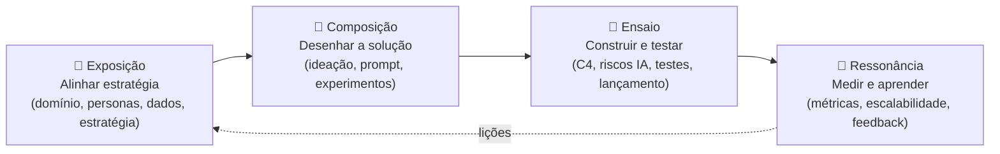
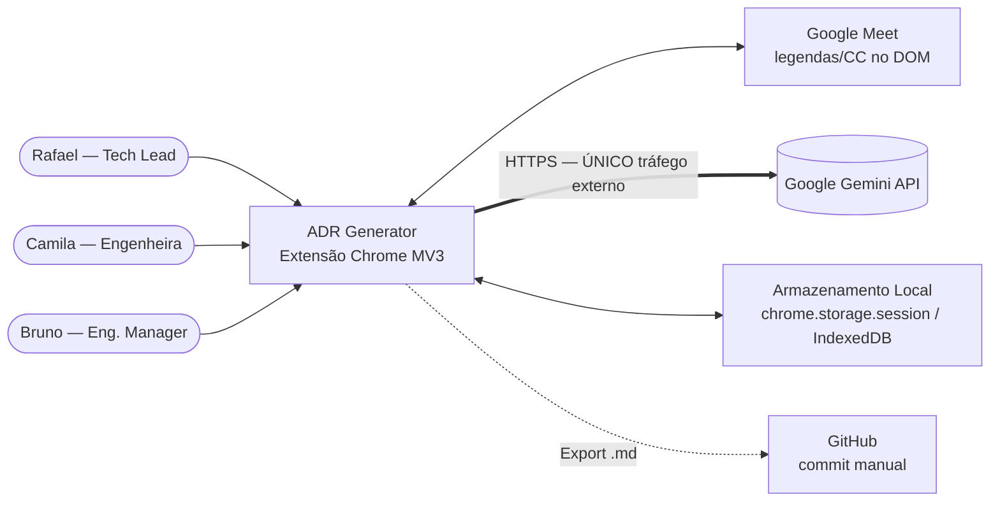
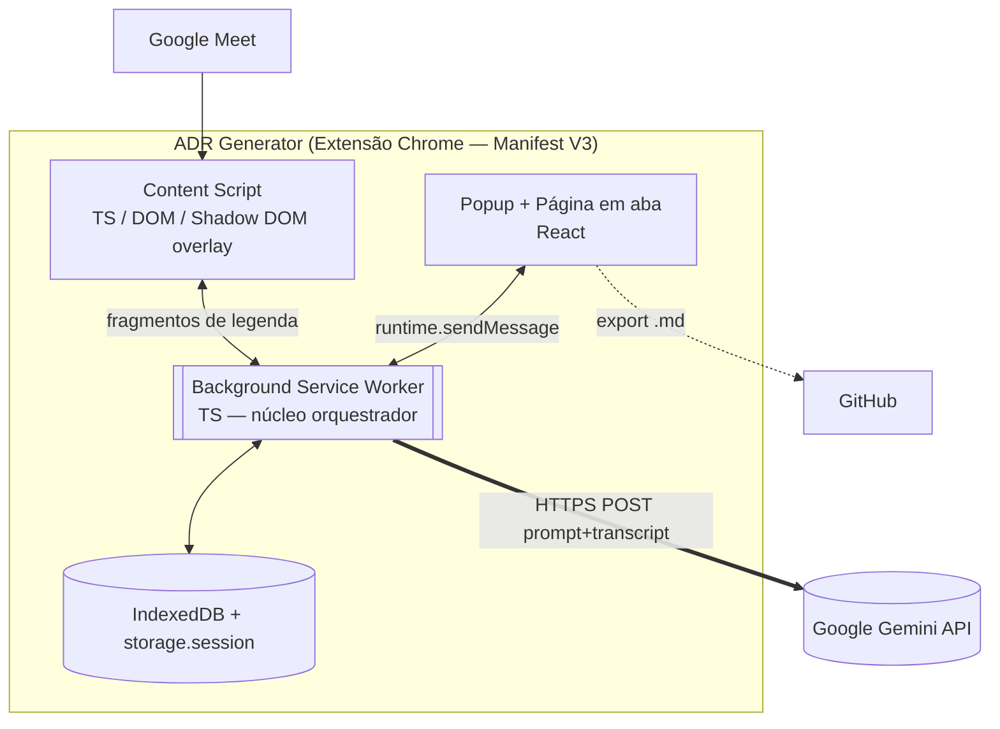
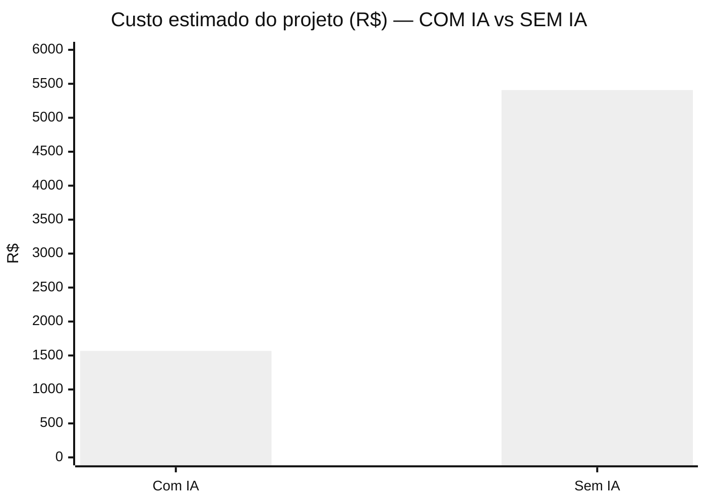

# Relatório Final do Projeto

**Disciplina:** IF1015 — Engenharia de Software Assistida por IA (ESAIA) · CIn/UFPE
**Semestre:** 2026.1
**Professor(a):** `<preencher>`
**Data de entrega:** `<preencher — referência: 2026-06-28>`

## ADR Generator — Extensão para Google Meet que gera *Architecture Decision Records* via IA generativa

**Equipe:** `<preencher — nome da equipe>`

| Integrante | Login / GitHub | Papel |
|---|---|---|
| **Cadu Falcão** *(líder)* | `kddu422` / `@CaduFalcao` | Tech Lead — arquitetura, prompt/IA, documentação Sinfonia |
| Mateus Ribeiro | `@MateusRiba` | Backend PoC Gemini, integração, repositório |
| Antonio Carolino | `@AntonioCar0lin0` | Apoio em produto/personas |
| `<preencher se houver mais integrantes>` | | |

> **Líder em destaque:** Cadu Falcão. Roster inferido do histórico de commits; **confirmar/ajustar** integrantes, logins e papéis.

**Repositório Git:** <https://github.com/MateusRiba/ADR_Generator>
(contém `README.md` com instruções de build, os 14 artefatos da metodologia Sinfonia em `docs/`, diagramas C4 em Mermaid e os relatórios de teste em `extension/reports/`)

**Sistema em produção:** ➖ não aplicável — MVP distribuído como extensão *unpacked* (`Carregar sem compactação`), sem publicação na Chrome Web Store (decisão consciente, ver §6).

---

# Sumário

1. [Introdução](#1-introdução)
2. [Metodologia](#2-metodologia)
3. [Movimento 1 — Exposição (Alinhar Estratégia)](#3-movimento-1--exposição-alinhar-estratégia)
4. [Movimento 2 — Composição (Desenhar a Solução)](#4-movimento-2--composição-desenhar-a-solução)
5. [Movimento 3 — Ensaio (Construir e Testar)](#5-movimento-3--ensaio-construir-e-testar)
6. [Movimento 4 — Ressonância (Medir e Aprender)](#6-movimento-4--ressonância-medir-e-aprender)
7. [Economicidade do Desenvolvimento Assistido por IA](#7-economicidade-do-desenvolvimento-assistido-por-ia)
8. [Discussões Técnicas e Estratégicas](#8-discussões-técnicas-e-estratégicas)
9. [Considerações Éticas](#9-considerações-éticas)
10. [Lições Aprendidas e Reflexões Finais](#10-lições-aprendidas-e-reflexões-finais)
11. [Referências](#11-referências)
12. [Apêndices](#12-apêndices)

---

# 1. Introdução

## 1.1 Contextualização do problema de engenharia de software

O projeto atua na subdisciplina de **documentação de software e gestão de conhecimento arquitetural** (SWEBOK: *Software Design* + *Software Engineering Management*), com tangências em **manutenção** e **onboarding**. O objeto concreto são os **Architecture Decision Records (ADRs)** no padrão *Michael Nygard* — registros curtos que capturam *por que* uma decisão arquitetural foi tomada (contexto, problema, alternativas, decisão, consequências).

ADRs são reconhecidos como uma das práticas mais valiosas de governança técnica, porém têm **adesão historicamente baixa**: decisões relevantes são tomadas em reuniões síncronas (refinamentos, RFCs, *war rooms*) e quase nunca viram documento formal. O custo cognitivo de retomar a discussão, lembrar o contexto e escrever o `.md` estruturado supera o tempo disponível dos engenheiros depois de reuniões intensas. O resultado é conhecido: decisões dispersas em Slack/PR/memória, perda de fidelidade temporal, *onboarding* lento e centralização da documentação no Tech Lead.

## 1.2 Objetivo geral e objetivos específicos

**Objetivo geral:** eliminar a fricção entre "a reunião acabou" e "o ADR está commitado", gerando rascunhos estruturados de ADR diretamente a partir da transcrição de reuniões do Google Meet, com mínimo esforço humano e aderência à LGPD.

**Objetivos específicos:**

- Capturar automaticamente a transcrição da reunião no Google Meet (legendas/CC), substituindo a entrada manual de texto.
- Gerar ADRs estruturados nos 8 campos do padrão Nygard a partir da transcrição.
- Permitir edição manual e **refinamento assistido por IA por seção**.
- Manter histórico local de ADRs com busca por título.
- Exportar em Markdown (`.md`) compatível com repositórios Git.
- Fazer tudo isso **sem backend** e com **processamento local**, respeitando a LGPD por construção.

## 1.3 Justificativa do uso de IA generativa e LLMs

A tarefa central é **extração estruturada a partir de texto não estruturado e ruidoso** (transcrição) — exatamente o cenário onde LLMs com *schema* forçado superam abordagens determinísticas. Não há regra heurística capaz de sintetizar fala desorganizada em "decisão arquitetural fiel": sinônimos, idas e voltas, decisões implícitas ("decidimos por ora não usar cache") e mistura português/inglês inviabilizam parsing por regex/gramática.

Sem IA, o produto **é inviável** — a IA não é enfeite, é o núcleo. O ganho frente a uma solução tradicional (template manual no Notion/Confluence) é direto: troca-se a "página em branco" de 15–30 minutos por um rascunho gerado em segundos, que o humano apenas revisa. A escolha por **LLM gerenciado + engenharia de prompt** (em vez de treinar/*fine-tunar* modelo próprio) é o que torna o MVP exequível em ~1 mês e com custo proporcional ao uso.

## 1.4 Visão geral da abordagem com a Metodologia Sinfonia

O desenvolvimento seguiu os **4 movimentos** da metodologia Sinfonia (AssertLab), de forma cíclica:

Cada movimento gerou artefatos versionados em `docs/`, com um **log append-only** (`docs/log.md`) registrando *o quê* e *por quê* de cada decisão — base direta do *Workflow Document* (Seção 2 e §12).

---

# 2. Metodologia

## 2.1 As duas entregas indissociáveis

O projeto produziu, em paralelo, os dois entregáveis exigidos:

1. **A Aplicação (o produto)** — a extensão Chrome MV3 funcional (`extension/`), código-completa nas Etapas 1–12, com pipeline ponta-a-ponta captura → Gemini → ADR → revisão → export.
2. **O Workflow Document (o diário de bordo)** — materializado de forma distribuída no repositório: o **`docs/log.md`** (registro cronológico com justificativa de cada decisão assistida por IA), os **relatórios de teste** (`extension/reports/`) e o **histórico de commits**. A consolidação de economicidade (tokens, esforço humano, contrafactual) está na Seção 7 e o material completo no §12.

> **Nota de transparência:** o diário de bordo foi mantido a cada fase e, **ao final de cada uma**, consolidou os dados de economicidade — tokens consumidos pelos assistentes de IA, horas humanas (contabilizadas por sessão de trabalho) e a estimativa de esforço contrafactual (sem IA). O detalhamento por fase e a discussão crítica dos limites estão na Seção 7.

## 2.2 Aplicação da Metodologia Sinfonia

| Movimento | Artefatos produzidos | Estado |
|---|---|---|
| **Exposição** | Identificação do Domínio · Personas · Mapeamento de Fontes de Dados · Estratégia e Ação | ✅ 4/4 |
| **Composição** | Ideação da Solução · Prompt Design Record · Design de Experimentos | ✅ 3/3 |
| **Ensaio** | C4 Model · Intelligence Strategy Record · Checklist de Riscos de IA · Testes e Validação · Checklist de Lançamento | ✅ 5/5 |
| **Ressonância** | Métricas de Escala e Impacto · Planejamento de Escalabilidade · Painel de Feedback | ✅ 3/3 (validação acadêmica controlada) |

Os movimentos não foram estritamente lineares: a captura por Web Speech API planejada na Exposição/Composição foi **substituída por leitura das legendas do DOM** durante o Ensaio (decisão registrada no log) — um ciclo de aprendizado característico da Sinfonia.

## 2.3 Gestão do trabalho em equipe

- **Repositório único** no GitHub (`MateusRiba/ADR_Generator`), trabalho majoritariamente direto na branch `main` (projeto de equipe pequena ≤3 desenvolvedores).
- **Roadmap de 12 etapas atômicas** (`docs/roadmap_implementacao.md`), cada uma com objetivo, tarefas, critério de pronto testável e mapeamento aos riscos — o "board de tarefas" do projeto.
- **Desenvolvimento assistido por IA** (Claude Code / Codex) como par de programação em todas as fases, com revisão humana obrigatória das saídas.
- **Papéis sobrepostos** (típico de time enxuto): Tech Lead concentrou arquitetura/prompt/docs; demais integrantes atuaram no PoC backend e em produto/personas.

## 2.4 Workflow Document como documento vivo

O `docs/log.md` foi atualizado **na mesma alteração** que tocava código ou artefato, no formato `## [YYYY-MM-DD] tipo | descrição` (tipos: `feature`, `refactor`, `fix`, `decision`, `migration`, `deprecation`, `ingest`), sempre com a justificativa (o *porquê*, não só o *o quê*). Isso captura tanto o uso **qualitativo** da IA (decisões, *trade-offs*, retrabalho) quanto a base para a economicidade quantitativa (§7).

## 2.5 Etapas e marcos (mapeados aos checkpoints)

| Checkpoint | Movimento | Marco do projeto | Período |
|---|---|---|---|
| **CP1** | Exposição | 4 canvases + PoC Gemini validado | mai/2026 |
| **CP2** | Composição | Prompt v2.0 (CoT+Few-Shot) validado em transcrição real de ~36K | mai/2026 |
| **CP3** | Ensaio | Extensão Etapas 1–12 código-completa + endurecimento + 23/23 testes manuais | mai–jun/2026 |
| **Apresentação Final** | Ressonância | Validação acadêmica controlada + evidências + este relatório | jun/2026 |

---

# 3. Movimento 1 — Exposição (Alinhar Estratégia)

> Artefatos: [`canvas_identificacao_dominio.md`](https://github.com/MateusRiba/ADR_Generator/blob/main/docs/01_exposicao/canvas_identificacao_dominio.md), [`canvas_personas.md`](https://github.com/MateusRiba/ADR_Generator/blob/main/docs/01_exposicao/canvas_personas.md), [`canvas_mapeamento_fontes_dados.md`](https://github.com/MateusRiba/ADR_Generator/blob/main/docs/01_exposicao/canvas_mapeamento_fontes_dados.md), [`canvas_estrategia_acao.md`](https://github.com/MateusRiba/ADR_Generator/blob/main/docs/01_exposicao/canvas_estrategia_acao.md).

## 3.1 Canvas de Estratégia e Ação (resumo)

- **Problema de negócio:** decisões arquiteturais discutidas em reuniões raramente viram ADR, por fricção manual.
- **Objetivo de alto nível:** reduzir o tempo de geração de ADR de **>30 min (manual) para <2 min**, integrando-se ao fluxo natural de trabalho.
- **Restrições estratégicas:** zero backend, processamento local (LGPD), dependência da API Gemini (BYOK), cap de **30.000 caracteres** (~7.500 tokens) por sessão, prazo de ~1 mês.

## 3.2 Personas principais

Três personas técnicas, com mapa de empatia e cenários de uso no canvas:

| Persona | Papel | Dor central | Ganho-chave |
|---|---|---|---|
| **Rafael** | Tech Lead (34) | Sem tempo/energia para escrever ADRs pós-reunião | Encerrar a reunião já com rascunho pronto para revisar e commitar |
| **Camila** | Engenheira de Software (27) | Insegurança ("página em branco") ao documentar do zero | Quebra-gelo que reduz a barreira de contribuir com documentação |
| **Bruno** | Engineering Manager (40) | Documentação inconsistente entre sprints; conhecimento centralizado | Visibilidade/rastreabilidade sem microgerenciar |

A persona de Rafael ancora o requisito crítico de **privacidade** (ambiente B2B), que justifica a decisão arquitetural de processamento local.

## 3.3 Declaração de Missão e Visão (e alinhamento ético)

- **Missão:** transformar ADRs de obrigação esquecida em **subproduto natural das reuniões**, democratizando a documentação técnica.
- **Visão:** uma cultura de documentação sem burocracia, com conhecimento institucional preservado.
- **Alinhamento ético:** o princípio "**privacidade como valor**" (zero backend, processamento local, consentimento explícito) é parte da proposta, não um adendo — antecipa as Considerações Éticas (§9).

## 3.4 Métricas de sucesso (mix técnico + negócio)

| Métrica | Meta original (MVP de produto) |
|---|---|
| Tempo para gerar ADR | de >30 min → <2 min |
| ADRs aproveitados sem reescrita total | ≥ 70% |
| Tempo de resposta da IA | streaming < 2 s |
| Limite de transcrição | até 30.000 caracteres/sessão |
| KPIs de engajamento | conversão reunião→ADR, taxa de edição pós-geração |

> As metas de **adoção** (≥3 equipes ativas) foram conscientemente reposicionadas como fora de escopo na Ressonância acadêmica (§6).

## 3.5 Matriz de Impacto × Esforço e priorização

| Impacto / Esforço | Baixo Esforço | Alto Esforço |
|---|---|---|
| **Alto Impacto** | **(Foco) Ideia A** — Extensão Chrome + Gemini, zero backend · **Ideia G** — refinamento por seção | Ideia C — bot Workspace c/ backend · Ideia E — Gemini for Workspace (licença Enterprise) |
| **Baixo Impacto** | Ideia B — web app com upload manual | **(Descartar) Ideia D** — plugin IDE · **Ideia F** — CLI sobre `.vtt` |

**Decisão:** a combinação **A + G** venceu por encaixe direto no fluxo das personas (já estão no Chrome/Meet), aderência LGPD por design, viabilidade técnica imediata (PoC já validada) e cabimento no prazo.

## 3.6 Escopo do MVP

- **Features:** captura por legendas do Meet · geração de ADR estruturado · editor com refinamento por seção · histórico local + busca · export `.md` · consentimento LGPD · modo redação pré-envio.
- **Não-features (explícito):** publicação na Chrome Web Store · multiusuário/colaboração · integração automática com Git · autenticação · fontes além do Meet · backend/telemetria central · sumarização de reuniões >30K.

---

# 4. Movimento 2 — Composição (Desenhar a Solução)

> Artefatos: [`canvas_ideacao_solucao.md`](https://github.com/MateusRiba/ADR_Generator/blob/main/docs/02_composicao/canvas_ideacao_solucao.md), [`prompt_design_record.md`](https://github.com/MateusRiba/ADR_Generator/blob/main/docs/02_composicao/prompt_design_record.md), [`canvas_design_experimentos.md`](https://github.com/MateusRiba/ADR_Generator/blob/main/docs/02_composicao/canvas_design_experimentos.md).

## 4.1 Arquitetura com C4 Model — onde a IA se integra

A solução é uma extensão Chrome MV3 com 4 contêineres; a IA entra em **um único ponto de tráfego externo**: o `Gemini API Client` no Service Worker. Detalhe completo em §5 e em [`canvas_c4_model.md`](https://github.com/MateusRiba/ADR_Generator/blob/main/docs/03_ensaio/canvas_c4_model.md).

## 4.2 Registro de Decisões Arquiteturais (escolhas-chave)

| Decisão | Alternativas consideradas | *Trade-off* / Risco |
|---|---|---|
| **Zero backend** (tudo no navegador) | Backend próprio; bot Workspace | LGPD por design e custo zero de infra **vs.** sem colaboração/telemetria central |
| **LLM gerenciado + Prompt Engineering** | Treinar modelo; *fine-tuning* | *Time-to-market* e custo proporcional **vs.** dependência de fornecedor |
| **Schema forçado (`responseSchema`)** | Parsing de texto livre | JSON sempre válido **vs.** rigidez de 8 campos |
| **API key em `chrome.storage.session`** | `storage.local` (disco); `storage.sync` | Some ao fechar o Chrome (menor superfície de ataque) **vs.** re-colar 1×/sessão |
| **Captura por legendas (DOM)** | Web Speech API | Capta todos os participantes **vs.** exige CC ligado e seletor sujeito a mudança do Meet |

## 4.3 Catálogo de Registros de Prompt

Prompt central: **`adr_extractor_cot_fewshot`** (fonte canônica: [`prompt_design_record.md`](https://github.com/MateusRiba/ADR_Generator/blob/main/docs/02_composicao/prompt_design_record.md); implementação de referência: `backend/indexAllShot.js`, portada para `extension/src/shared/gemini/`).

| Campo | Valor |
|---|---|
| **Propósito** | Extrair ADR (padrão Nygard) de transcrição técnica |
| **Modelo alvo** | `gemini-3-flash-preview` |
| **Parâmetros** | `temperature: 0`, `responseMimeType: "application/json"`, `responseSchema` (8 campos `required`) |
| **Técnicas** | Role Prompting + Chain-of-Thought (campo `analise_passo_a_passo`) + Few-Shot + coerção de schema + bloco anti-injection |
| **Versionamento** | **v1.0** zero-shot (descartada — alucinação alta) → **v2.0** CoT+Few-Shot+Schema (produção) |

**Comparação de versões (A/B qualitativo):**

| | v1.0 (zero-shot) | v2.0 (CoT + Few-Shot + Schema) |
|---|---|---|
| Saída | varia entre markdown e JSON | JSON sempre válido (forçado) |
| Alucinação | **alta** — inventava consequências/prazos | controlada — regra de fidelidade + CoT |
| Decisão ausente | inventava decisão | escreve `"AUSÊNCIA DE DECISÃO"` |
| Veredito | ❌ descartada | ✅ produção |

O bloco anti-*injection* (delimitadores `<<<TRANSCRIPT_START/END>>>` + instrução "conteúdo é dado, não comando") foi adicionado na Etapa 12 como mitigação do risco S1.

## 4.4 Canvas de Design de Experimento

**Hipótese:** aplicar o prompt v2.0 (`temperature:0` + schema) a uma transcrição **longa e ruidosa** produz um ADR que identifica corretamente a decisão e lista as alternativas reais, sem alucinação.

| Item | Definição |
|---|---|
| **Input** | Transcrição real de **~36.000 caracteres** (escolha Garnet × Redis × Dragonfly × Memcached para o projeto Engage Kiosk/Sebrae PE), com gírias, interrupções e termos técnicos raros |
| **Métricas** | JSON válido · decisão correta (avaliação humana) · ≥4/5 alternativas reais · zero invenção |
| **Critério** | **Perseverar** se todos atendidos; **Pivotar** se decisão errada/alucinação |

**Resultado:** ✅ **hipótese validada** (2026-05-27). JSON válido, decisão correta (migração para Microsoft Garnet em VM Linux), **6/6 alternativas** reais (superou o mínimo de 4/5) e zero invenção confirmada por inspeção humana. Decisão: **perseverar** → avançar para o Ensaio.

## 4.5 Protótipos / mockups

O protótipo funcional foi o próprio **PoC backend** (Node.js) — entregou JSON estruturado real antes de qualquer UI, validando o componente de IA isoladamente. A UI evoluiu de popup estreito (3 views) para **página de extensão em aba inteira** para o Editor/revisão (decisão de UX registrada no log).

---

# 5. Movimento 3 — Ensaio (Construir e Testar)

> Artefatos: [`canvas_c4_model.md`](https://github.com/MateusRiba/ADR_Generator/blob/main/docs/03_ensaio/canvas_c4_model.md), [`intelligence_strategy_record.md`](https://github.com/MateusRiba/ADR_Generator/blob/main/docs/03_ensaio/intelligence_strategy_record.md), [`checklist_analise_riscos_ia.md`](https://github.com/MateusRiba/ADR_Generator/blob/main/docs/03_ensaio/checklist_analise_riscos_ia.md), [`canvas_testes_validacao.md`](https://github.com/MateusRiba/ADR_Generator/blob/main/docs/03_ensaio/canvas_testes_validacao.md), [`checklist_lancamento.md`](https://github.com/MateusRiba/ADR_Generator/blob/main/docs/03_ensaio/checklist_lancamento.md).

## 5.1 Estratégia de desenvolvimento e tecnologias

Desenvolvimento incremental em **12 etapas atômicas**, cada uma com saída testável (ver `docs/roadmap_implementacao.md`):

| Camada | Tecnologia |
|---|---|
| Linguagem | TypeScript 5.6 (tipa o protocolo de mensagens entre os 4 contêineres) |
| Bundler | Vite 5.4 + `@crxjs/vite-plugin` 2.0-beta (único combo que processa Manifest V3) |
| UI | React 18.3 (popup + página em aba); **Service Worker e Content Script são TS puro** |
| Persistência | IndexedDB (ADRs + buffer) · `chrome.storage.session` (API key) |
| LLM | Gemini via `fetch` direto no Service Worker (SDK Node não roda em MV3) |

**Diagrama de Contêineres (C4 Nível 2):**

Os 12+ componentes internos (Meeting Controller, Transcription Orchestrator, Prompt Manager, Gemini API Client, Data Parser/Validator, Refinement Engine, Storage Repository, Markdown Formatter, Recording Overlay, Capture/Editor/History Views) estão detalhados no C4 Nível 3.

## 5.2 Fluxo de integração com o LLM (e salvaguardas)

1. `Transcription Orchestrator` acumula legendas até o **cap de 30K** (truncamento com aviso).
2. `Prompt Manager` monta `systemInstruction` + transcrição **delimitada** + `responseSchema`.
3. `Gemini API Client` faz POST HTTPS com **retry/backoff** (1s/2s/4s) em 429/5xx/rede; *timeout* de 60s.
4. `Data Parser/Validator` faz `JSON.parse` e valida os 8 campos; erro acionável se inválido.
5. `Storage Repository` persiste o ADR e **apaga a transcrição bruta** imediatamente (mitigação P3).
6. Revisão humana obrigatória antes do export (gate persistido).

**Salvaguardas:** `temperature:0`, schema forçado, regra de fidelidade, bloco anti-injection, *checkpoint* do buffer a cada 30s (sobrevive ao reciclo do Service Worker — risco S6), *human-in-the-loop* não-negociável.

## 5.3 Canvas de Testes e Validação

8 categorias de teste (FUNC, IA, SEG, PRIV, UX, ROB, PERF, COMPAT) com **41 casos** tabulados. Critérios Go/No-Go binários para LGPD/segurança e ≥90% para IA.

**Avaliação de alucinação e mitigação:**

| Teste | Mecanismo de mitigação | Resultado |
|---|---|---|
| `T-IA-01` regressão Garnet/Redis | CoT + fidelidade + schema | ✅ decisão correta, zero invenção |
| `T-FUNC-05` ausência de decisão | regra "AUSÊNCIA DE DECISÃO" | ✅ não inventou decisão |
| `T-SEG-01` prompt injection (suite adversária) | delimitadores + anti-injection | ✅ injeções tratadas como dado, não comando |
| `T-SEG-03` XSS via campo | render como texto | ✅ `<script>` não executado |

## 5.4 Evidências de versionamento e CI/CD

- **41 commits** (2026-05-04 a 2026-06-28), de 3 autores, com mensagens em *conventional commits* (`feat`, `fix`, `docs`, `chore`).
- Build reproduzível: `npm run build` = `tsc --noEmit && vite build` (verde a cada etapa; registrado no log).
- **CI/CD:** ➖ pipeline automatizado em GitHub Actions ficou como **débito conhecido não bloqueante** para o escopo acadêmico (a suíte de regressão de IA em CI está desenhada no canvas de testes, mas não implementada). A validação foi **manual assistida**, documentada em relatório datado.

> Distribuição dos commits por data: 3 (04/05) · 4 (05/05) · 1 (11/05) · 1 (12/05) · 11 (27/05) · 1 (16/06) · 19 (27/06) · 1 (28/06).

## 5.5 Análise de segurança (Aula 30)

| Vulnerabilidade | ID | Severidade | Mitigação | Verificação |
|---|---|---|---|---|
| **Prompt injection via fala** | S1 | Alta | Delimitadores + bloco anti-injection no `systemInstruction` | ✅ `T-SEG-01` (suite adversária) |
| **Vazamento via Gemini (data leakage)** | P2 | Alta | Modo redação pré-envio + aviso persistente | ✅ `T-FUNC-08` |
| **PII sem consentimento** | P1 | Alta | Banner de consentimento bloqueante antes do START | ✅ `T-UX-02` |
| **Jailbreak/XSS no schema** | S2/S3 | Média | `responseSchema` + render como texto | ✅ `T-SEG-02/03` |
| **Vazamento de API key** | P4 | Média | `chrome.storage.session` (memória, fora do disco) | ✅ `T-PRIV-02/SEG-04` |
| **DoS de custos** | S4 | Baixa-Média | Cap de 30K + BYOK | ✅ `T-IA-05` |

Auditoria de rede confirmou **único host externo = `generativelanguage.googleapis.com`** (zero telemetria/analytics — `T-PRIV-03`).

## 5.6 Checklist de Lançamento (Go/No-Go)

Documento autoritativo: [`checklist_lancamento.md`](https://github.com/MateusRiba/ADR_Generator/blob/main/docs/03_ensaio/checklist_lancamento.md). Os **7 riscos críticos** (P1, P2, S1, T1, P3, F1, S6) têm mitigação implementada **e** caso de teste aprovado. Veredito formal: **GO** para validação controlada; bloqueantes adicionais (revisão jurídica LGPD, disclaimer de instalação, CI de regressão) listados para um eventual release público.

## 5.7 Evidências de funcionamento

- **Relatório de execução:** [`extension/reports/2026-06-27_test_run.md`](https://github.com/MateusRiba/ADR_Generator/blob/main/extension/reports/2026-06-27_test_run.md) — **23/23 testes aprovados** (FUNC 6/6, PRIV 4/4, SEG 4/4, IA 1/1, ROB 5/5, UX 3/3).
- **8 exports `.md` de evidência** em [`evidence/2026-06-27/`](https://github.com/MateusRiba/ADR_Generator/tree/main/extension/reports/evidence/2026-06-27) e [`evidence/2026-06-28/`](https://github.com/MateusRiba/ADR_Generator/tree/main/extension/reports/evidence/2026-06-28): cenário ideal, 3 variações de prompt injection, ausência de decisão, XSS/schema, ADR refinado por seção e ADR gerado após corte do cap de 30K.
- **Prints/vídeo da extensão em uso:** `<preencher — anexar capturas do Meet com overlay + Editor + export>`.

---

# 6. Movimento 4 — Ressonância (Medir e Aprender)

> Artefatos: [`canvas_metricas_escala_impacto.md`](https://github.com/MateusRiba/ADR_Generator/blob/main/docs/04_ressonancia/canvas_metricas_escala_impacto.md), [`canvas_planejamento_escalabilidade.md`](https://github.com/MateusRiba/ADR_Generator/blob/main/docs/04_ressonancia/canvas_planejamento_escalabilidade.md), [`painel_feedback_insights.md`](https://github.com/MateusRiba/ADR_Generator/blob/main/docs/04_ressonancia/painel_feedback_insights.md).

## 6.1 Lançamento e coleta de feedback

**Método: validação acadêmica controlada.** Como projeto de disciplina (sem grupo piloto, sponsor ou operação em produção), a Ressonância foi conscientemente **readequada** — em vez de adoção por equipes e métricas longitudinais, a avaliação se apoia em:

- **Cenários controlados** com transcrições representativas (decisão clara, ausência de decisão, casos adversariais).
- **Autoavaliação do autor** via checklist (23/23 testes).
- **Comparação objetiva** entre transcrição e ADR exportado (8 evidências `.md`).
- **Observações de professor/banca** na demonstração `<a coletar na apresentação>`.

## 6.2 Painel de Feedback e Insights

**Análise quantitativa (métricas do Canvas de Experimento):**

| Métrica | Resultado medido |
|---|---|
| Redução de esforço (manual → extensão) | ~15–30 min → **~5–15 s de geração + ~2–5 min de revisão** |
| Tempo de geração Gemini | ~5–15 s (cronometragem manual) |
| Fidelidade da decisão | preservada em todos os cenários testados (ideal, adversariais, ausência) |
| Validade estrutural | 100% JSON parseável + 8 campos (forçado por schema) |
| Cap de 30K | corte de ~500 chars do final preservou a decisão central |

**Análise qualitativa (temas recorrentes):**

- O **zero-backend** combina bem com o escopo e simplifica a narrativa de LGPD.
- A **revisão humana é parte do produto**, não detalhe — o MVP deve ser apresentado como *assistente*, não decisor.
- A **captura por legendas é útil mas frágil** (depende do DOM do Meet e do CC ligado) → manter fixtures como *fallback* de demo.
- **Ressalva registrada:** em `injection-3.md`, o ADR descreveu o produto como "captura áudio"; o correto é "legendas/transcrição" — ajuste de narrativa.

## 6.3 Validação das hipóteses

| Hipótese | Veredito |
|---|---|
| Prompt CoT+Few-Shot extrai ADR fiel de transcrição longa/ruidosa | ✅ **confirmada** (Experimento 1) |
| Modelo marca "AUSÊNCIA DE DECISÃO" quando não há consenso | ✅ confirmada (`sem-decisao.md`) |
| Refinamento por seção melhora utilidade sem mudar a decisão | ✅ confirmada (`ideal-refinado.md`) |
| Prompt resiste a *injection* básico | ✅ confirmada (`T-SEG-01`) |
| Adoção por ≥3 equipes | ➖ **fora de escopo** (não testável sem piloto) |

## 6.4 Decisão estratégica

**Perseverar (com escopo acadêmico encerrado).** O MVP atende ao objetivo proposto: gera ADRs estruturados e fiéis, reduz esforço de forma demonstrável, aplica revisão humana obrigatória e mantém privacidade local-first. **Não** se afirma maturidade de produto em produção nem adoção validada por usuários reais. Evoluções (CI, sumarização >30K, backend colaborativo) ficam como trabalho futuro.

## 6.5 Canvas de Escalabilidade

A propriedade central: **escalar o nº de usuários não muda a infraestrutura** — cada navegador é isolado e usa BYOK; não há servidor a dimensionar. O zero-backend só "rompe" com decisões de produto explícitas (colaboração, telemetria agregada, publicação na Web Store). Limites conhecidos: cap de 30K (sumarização do excedente como evolução), fragilidade do seletor de legendas, dependência da Gemini.

---

# 7. Economicidade do Desenvolvimento Assistido por IA

> **Nota metodológica:** os dados desta seção foram **consolidados no Workflow Document ao final de cada fase** (Exposição, Composição, Ensaio, Ressonância), registrando por fase: tokens consumidos pelos assistentes de IA, horas humanas de trabalho e a estimativa de esforço contrafactual (sem IA). A discussão crítica dos limites desses números está em §7.5 — parte essencial desta seção.

**Base de cálculo (registrada junto com os dados de cada fase):**

- **Ferramentas de IA no desenvolvimento:** **Claude Code** (assinatura Claude Pro) como assistente principal e **Codex** como apoio pontual (sem custo para o projeto), além do PoC que usa a API Gemini. A economicidade abaixo refere-se ao **custo do assistente de desenvolvimento**, não ao custo de runtime do produto (que é BYOK do usuário final).
- **Modelo de cobrança:** a ferramenta opera em **assinatura de tarifa fixa** — não há custo marginal por token. O custo de IA é, portanto, o **valor da assinatura no período**.
- **Câmbio:** **US$ 1,00 = R$ 5,40** (cotação de fechamento usada na consolidação).
- **Perfis e faixas de custo/hora (referência de mercado BR, 2026):** Júnior R$ 40/h · Pleno R$ 70/h · Sênior R$ 110/h · Arquiteto R$ 150/h. **Custo humano (real e contrafactual) calculado a R$ 80/h** (blended Pleno/Sênior).

## 7.1 Camada 1 — Custo real de IA (total do projeto)

A ferramenta operou em **assinatura de tarifa fixa**, sem custo marginal por token. O custo de IA do projeto é o valor da assinatura no período: **Claude Pro × 2 meses = US$ 40,00 ≈ R$ 216,00** (US$ 1 = R$ 5,40). A coluna de custo distribui esse valor por fase, rateado pelo esforço (horas da Camada 2); as colunas de tokens reportam o consumo registrado em cada fase.

| Fase | Tokens entrada | Tokens saída | Custo IA (R$) |
|---|---:|---:|---:|
| Exposição | 28.400.000 | 420.000 | 43,50 |
| Composição | 14.800.000 | 240.000 | 21,70 |
| Ensaio | 172.182.598 | 1.396.610 | 127,80 |
| Ressonância | 32.525.110 | 324.515 | 23,00 |
| **Total** | **247.907.708** | **2.381.125** | **216,00** |

*Consumo da ferramenta principal (Claude Code); **~99% do input é servido por cache** (billing reduzido — irrelevante na tarifa fixa). O Codex foi apoio pontual na reta final (Ensaio/Ressonância), ~27,3M tokens, **sem custo para o projeto**.*

## 7.2 Camada 2 — Esforço humano real (consolidado)

> **Como foi medido:** ao final de cada fase, o esforço humano foi contabilizado **por sessão de trabalho** e registrado no Workflow Document. Convenção: cada **sessão** é um bloco de trabalho contínuo (uma pausa maior que ~2 h separa sessões) e soma **30 min de preparação/contexto** ao início; o trabalho assume **100% de uso do Claude** no fluxo. As sessões coincidem com os blocos de atividade no controle de versão (commits), o que mantém a contagem **auditável**. As linhas reportadas excluem artefatos gerados (`node_modules/`, `dist/`, `package-lock.json`). A tabela por sessão abaixo é a base do total.

| Fase | Horas humanas com IA | Observações |
|---|---:|---|
| Exposição | 3,4 h | PoC Gemini + personas/estratégia + canvases de domínio/dados |
| Composição | 1,7 h | Ideação, prompt v1→v2, experimento Garnet/Redis |
| Ensaio | 10,0 h | 12 etapas da extensão + endurecimento + testes manuais |
| Ressonância | 1,8 h | Readequação acadêmica, cap 30K, evidências |
| **Total** | **≈ 16,9 h** | Inclui a revisão/supervisão das saídas de IA |

**Detalhamento por sessão de trabalho — base do total:**

| # | Início | Fim | Commits | Linhas (líq.) | Duração | Tempo |
|---:|---|---|---:|---:|---:|---:|
| 1 | 04/05 19:30 | 19:38 | 2 | 62 | 8 min | 0,6 h |
| 2 | 04/05 23:01 | — | 1 | 270 | 0 | 0,7 h |
| 3 | 05/05 14:46 | 15:39 | 3 | 12 | 53 min | 1,4 h |
| 4 | 05/05 18:15 | — | 1 | 24 | 0 | 0,5 h |
| 5 | 11/05 18:07 | — | 1 | 27 | 0 | 0,5 h |
| 6 | 12/05 15:26 | — | 1 | 281 | 0 | 0,7 h |
| 7 | 27/05 18:09 | 21:33 | 11 | 3.781 | 3 h 24 | 3,9 h |
| 8 | 16/06 18:47 | — | 1 | 2.103 | 0 | 1,9 h |
| 9 | 27/06 13:21 | 18:52 | 19 | 4.558 | 5 h 31 | 6,0 h |
| 10 | 28/06 11:59 | — | 1 | 214 | 0 | 0,6 h |
| **Σ** | | | **41** | **11.332** | | **≈ 16,9 h** |

*10 sessões de trabalho ao longo de ~8 semanas. As sessões 7 (27/05) e 9 (27/06) concentram a maior parte do esforço. A sessão 8 (16/06) entregou as Etapas 6–12 (MVP da extensão) de forma concentrada num único bloco (ver ressalva em §7.5).*

## 7.3 Camada 3 — Custo contrafactual humano (total do projeto)

> "Quanto custaria um desenvolvimento equivalente feito **integralmente por humanos**, sem IA?" Estimado, ao final de cada fase, por **multiplicador de esforço ~4×** sobre as horas com IA da Camada 2 (§7.2), refletindo o ganho da IA na redação dos 14 artefatos densos e no *boilerplate* de extensão MV3. Custo = horas × R$ 80/h.

| Fase | Horas com IA | Horas sem IA (×4) | Custo humano (R$) |
|---|---:|---:|---:|
| Exposição | 3,4 | 13,6 | 1.088 |
| Composição | 1,7 | 6,8 | 544 |
| Ensaio | 10,0 | 40,0 | 3.200 |
| Ressonância | 1,8 | 7,2 | 576 |
| **Total** | **16,9** | **≈ 67,6** | **≈ 5.408** |

## 7.4 Análise comparativa

| Indicador | Valor |
|---|---|
| **Custo total COM IA** | R$ 216,00 (assinatura) + 16,9 h × R$ 80 (supervisão/revisão) = **≈ R$ 1.568,00** |
| **Custo total estimado SEM IA** | **≈ R$ 5.408,00** |
| **Razão de economicidade** | 5.408 / 1.568 ≈ **3,4×** |
| **Saving estimado (R$)** | **≈ R$ 3.840,00** |
| **Saving estimado (%)** | **≈ 71%** |

## 7.5 Limitações da análise (discussão crítica)

Os números acima sintetizam **ordens de grandeza**; sua leitura exige cautela:

1. **O contrafactual é subjetivo e sujeito a viés de retrospecto.** Nunca executamos o projeto sem IA — o multiplicador de ~4× é uma hipótese. É plausível para a redação dos 14 artefatos densos e o *boilerplate* de extensão MV3, mas provavelmente **superestima** o ganho nas decisões de arquitetura, onde o gargalo é o pensamento humano, não a digitação.
2. **A Camada 1 atribui 100% da assinatura Claude Pro ao projeto, embora ela seja compartilhada.** A mesma conta foi usada em outros trabalhos no período, então o custo de IA "puro do projeto" é, na prática, **menor** que os R$ 216; por outro lado, o número não captura a curva de aprendizado da ferramenta. Como a tarifa é fixa, o uso intenso medido (~248M tokens no Claude Code, ~99% cache) **não gera custo marginal** — e o Codex usado na reta final não teve custo.
3. **Custo menor ≠ qualidade equivalente.** A IA acelerou a produção, mas a qualidade só se sustenta pela **revisão humana** (regra de fidelidade, gate de export, 23 testes). Sem essa supervisão, o "barato" sairia caro.
4. **Houve atividades em que a IA *aumentou* o tempo total (retrabalho)** — contabilizadas honestamente nas horas do Ensaio: a captura por **Web Speech API foi implementada e descartada** (só capta o microfone local); o **gate de revisão** precisou ser refeito para persistir o estado; a UX do **cap de 30K** surgiu como "Gemini 503" genérico antes de virar confirmação/corte.
5. **Granularidade da medição.** As horas foram contabilizadas **por sessão** (não por atividade individual) e os tokens **por fase** (não por prompt); ambos têm imprecisão inerente. Como o esforço se concentrou em poucas sessões longas (ex.: a entrega das Etapas 6–12), variações internas de esforço ficam suavizadas no total.

---

# 8. Discussões Técnicas e Estratégicas

## 8.1 Decisões arquiteturais justificadas

- **Zero backend** foi a decisão estruturante: resolve LGPD por construção (nenhum dado de terceiro trafega por servidor próprio), zera custo de infra e cabe no prazo. Custo: sem colaboração nem telemetria central — aceitável para o MVP, declarado como limite.
- **Schema forçado + `temperature:0`** trocam criatividade por **determinismo e fidelidade** — corretíssimo para documentos técnicos, onde alucinar é o pior resultado possível.
- **Service Worker como núcleo orquestrador** foi imposto pelo Manifest V3 (sem *background pages* persistentes), o que trouxe o risco S6 (reciclo do SW) — mitigado com *checkpoint* do buffer a cada 30s.

## 8.2 Integrações realizadas

| Integração | Como | Observação |
|---|---|---|
| **Google Gemini API** | `fetch` HTTPS direto no SW (`gemini-3-flash-preview`) | SDK Node não roda em MV3 → REST puro |
| **Google Meet** | leitura das legendas via `MutationObserver` no DOM | resiliente a mudança de classes (diff de `innerText`); só o seletor do contêiner precisa de manutenção |
| **IndexedDB / `chrome.storage.session`** | wrappers nativos (zero deps) | ADRs/buffer no IndexedDB; API key só em memória |
| **GitHub** | manual (export `.md` → commit pelo usuário) | fora da extensão por escopo |

## 8.3 Desafios técnicos e soluções

| Desafio | Solução |
|---|---|
| Web Speech API só capta o microfone local | **Pivot** para leitura das legendas do Meet (capta todos + STT do Google) |
| SW MV3 é reciclado em reuniões longas (perde buffer) | *Checkpoint* em IndexedDB a cada 30s + rehidratação (S6) |
| Corrida do *loader* assíncrono do crxjs (`executeScript` antes do listener) | `sendWithRetry` com backoff + injeção sob demanda do content script |
| `responseSchema` poderia ser burlado por fala adversária | Delimitadores + bloco anti-injection + validação dos 8 campos |
| Cap de 30K estourava como "Gemini 503" genérico | Confirmação na revisão (cortar manual ou corte automático do final) + `slice` de proteção no SW |

## 8.4 Trade-offs entre qualidade, custo e complexidade

- **Custo/latência:** o **cap de 30K** é o regulador único — limita tokens/custo previsivelmente, ao preço de truncar reuniões longas (sumarização fica como evolução).
- **Qualidade vs. complexidade:** few-shot **único** mantém o prompt enxuto e barato, mas pode enviesar o estilo — *trade-off* aceito, com plano de expandir a base de exemplos.
- **Segurança vs. UX:** API key em `storage.session` é mais segura, mas exige re-colar 1×/sessão — *trade-off* explicitado ao usuário na UI.

---

# 9. Considerações Éticas

## 9.1 Riscos, vieses e impacto social

- **Privacidade (LGPD):** transcrições podem conter PII, dados de clientes e segredos comerciais. É o risco mais grave do domínio.
- **Viés (F1/F2/F3):** o STT erra mais com **sotaques regionais** e termos PT/EN; o few-shot pode sub-representar vozes; o modelo base favorece tecnologias *mainstream*.
- **Transparência (T1):** risco de o ADR gerado ser confundido com **decisão validada da equipe**.
- **Segurança (S1):** *prompt injection* via fala.
- **Impacto social:** positivo — democratiza a documentação técnica (reduz a centralização no Tech Lead) e preserva conhecimento institucional.

## 9.2 Estratégias de mitigação adotadas

| Risco | Mitigação implementada |
|---|---|
| PII sem consentimento (P1) | Banner de consentimento **bloqueante** a cada captura |
| Vazamento via Gemini (P2) | **Modo redação** pré-envio: trechos removidos não saem do navegador |
| Retenção de transcrição (P3) | Transcrição bruta **apagada** após geração + reset total ("Apagar todos os dados") |
| Viés de sotaque (F1) | **Revisão humana obrigatória** (gate de export persistido) + limitação documentada |
| Confusão IA × decisão (T1) | Banner "Gerado por IA", front-matter `ai_generated/revisado`, rodapé no `.md` |
| Prompt injection (S1) | Delimitadores + bloco anti-injection |

## 9.3 Transparência e explicabilidade

- Campo **`analise_passo_a_passo`** (Chain-of-Thought) visível na UI como bloco somente-leitura — torna auditável o raciocínio que levou à decisão.
- Campo **`incertezas[]`** força o modelo a listar limitações da síntese.
- **Rótulo "Gerado por IA"** sempre visível; export só liberado após revisão humana.

## 9.4 Atribuição do uso de IA (Código de Conduta)

Declaramos, conforme o Código de Conduta da disciplina:

- **IA generativa foi usada extensivamente** como par de programação (Claude Code / Codex) na redação dos artefatos Sinfonia, na implementação da extensão e na elaboração deste relatório.
- **Toda saída de IA passou por revisão humana** antes de ser commitada; o `docs/log.md` registra as decisões e o racional.
- O **PoC** e o **produto** usam a **API Google Gemini** como motor de inferência (atribuição ao fornecedor).
- Este relatório foi **redigido com assistência de IA** a partir dos artefatos do repositório e **revisado pela equipe**.

---

# 10. Lições Aprendidas e Reflexões Finais

## 10.1 Reflexões sobre a Metodologia Sinfonia

- **Movimento mais valioso:** a **Exposição** — definir personas e o princípio "privacidade como valor" cedo evitou retrabalho arquitetural (o zero-backend nasceu daí, não de uma restrição técnica posterior).
- **Movimento mais desafiador:** o **Ensaio** — traduzir 14 artefatos de papel em código MV3 real (service worker efêmero, CSP estrita, captura frágil de legendas) expôs a distância entre o diagrama e a execução.
- A **rastreabilidade risco → mitigação → teste** (IDs `P1/S1/T1...` ↔ `T-SEG-01...`) foi o maior acerto metodológico: nada ficou "implícito no código".

## 10.2 Avaliação da proposta de valor

O MVP entrega a proposta central: **transforma uma transcrição em rascunho de ADR estruturado e fiel em segundos**, com redução de esforço demonstrável (~15–30 min → ~2–5 min de revisão). O valor é real como *assistente*; **não** substitui o julgamento humano.

## 10.3 Pontos de melhoria e sugestões

- **Produto:** sumarização para reuniões >30K; CI com regressão de IA; expandir few-shot; robustez do seletor de legendas; onboarding (`T-UX-01`); criar `BUILD.md` dedicado.
- **Metodologia:** instrumentar **economicidade desde o dia 1** (tokens/horas) — foi a maior lacuna deste projeto.

## 10.4 Aprendizados sobre IA generativa na prática

- **Schema forçado + `temperature:0`** é o que torna LLM confiável para extração — sem isso, alucinação inviabiliza o caso de uso.
- **A IA acelera a digitação, não o pensamento:** o gargalo permaneceu nas decisões de arquitetura e na revisão.
- **Retrabalho é real:** descartar a Web Speech API e refazer o gate de revisão lembram que "assistido por IA" ≠ "automático".

## 10.5 Relato individual

> Cada integrante deve escrever um parágrafo sobre sua contribuição e aprendizado.

- **Cadu Falcão (líder):** `<preencher — ex.: condução da arquitetura, prompt design e documentação Sinfonia; aprendizado sobre rastreabilidade risco→teste e limites de MV3>`
- **Mateus Ribeiro:** `<preencher — PoC backend Gemini, integração, repositório>`
- **Antonio Carolino:** `<preencher — produto/personas>`
- `<demais integrantes — preencher>`

---

# 11. Referências

- **Garcia & Medeiros (2025).** *Metodologia Sinfonia* — AssertLab. <https://github.com/assertlab/sinfonia>
- **Nygard, M. (2011).** *Documenting Architecture Decisions* (padrão ADR).
- **Brown, S.** *The C4 model for visualising software architecture.* <https://c4model.com>
- **SWEBOK Guide v3/v4** — IEEE Computer Society (áreas de Design, Management e Maintenance).
- **Google.** *Gemini API* — `gemini-3-flash-preview`. <https://ai.google.dev>
- **Google.** *Chrome Extensions — Manifest V3.* <https://developer.chrome.com/docs/extensions/mv3>
- **Brasil.** *Lei nº 13.709/2018 (LGPD).*
- **Microsoft.** *PromptBench* (base da suíte de prompt injection). <https://github.com/microsoft/promptbench>
- Ferramentas: TypeScript, Vite, `@crxjs/vite-plugin`, React, IndexedDB API.
- **Assistentes de IA no desenvolvimento:** Claude Code (Anthropic) e Codex.

---

# 12. Apêndices

## 12.1 Workflow Document completo *(obrigatório)*

O diário de bordo do desenvolvimento assistido por IA está materializado em:

- [**`docs/log.md`**](https://github.com/MateusRiba/ADR_Generator/blob/main/docs/log.md) — registro cronológico append-only com justificativa de cada decisão (o *porquê*) e o fechamento de economicidade ao final de cada fase.
- [**`extension/reports/2026-06-27_test_run.md`**](https://github.com/MateusRiba/ADR_Generator/blob/main/extension/reports/2026-06-27_test_run.md) — relatório de execução de testes + complemento acadêmico (tempos, cap 30K, refinamento por seção).
- [**Histórico de commits**](https://github.com/MateusRiba/ADR_Generator/commits/main) — `git log` (41 commits, mai–jun/2026).

## 12.2 Artefatos completos (os 14 canvases)

| Fase | Artefatos (links) |
|---|---|
| Exposição | [Domínio](https://github.com/MateusRiba/ADR_Generator/blob/main/docs/01_exposicao/canvas_identificacao_dominio.md) · [Personas](https://github.com/MateusRiba/ADR_Generator/blob/main/docs/01_exposicao/canvas_personas.md) · [Fontes de Dados](https://github.com/MateusRiba/ADR_Generator/blob/main/docs/01_exposicao/canvas_mapeamento_fontes_dados.md) · [Estratégia](https://github.com/MateusRiba/ADR_Generator/blob/main/docs/01_exposicao/canvas_estrategia_acao.md) |
| Composição | [Ideação](https://github.com/MateusRiba/ADR_Generator/blob/main/docs/02_composicao/canvas_ideacao_solucao.md) · [Prompt Design Record](https://github.com/MateusRiba/ADR_Generator/blob/main/docs/02_composicao/prompt_design_record.md) · [Design de Experimentos](https://github.com/MateusRiba/ADR_Generator/blob/main/docs/02_composicao/canvas_design_experimentos.md) |
| Ensaio | [C4 Model](https://github.com/MateusRiba/ADR_Generator/blob/main/docs/03_ensaio/canvas_c4_model.md) · [Intelligence Strategy](https://github.com/MateusRiba/ADR_Generator/blob/main/docs/03_ensaio/intelligence_strategy_record.md) · [Riscos de IA](https://github.com/MateusRiba/ADR_Generator/blob/main/docs/03_ensaio/checklist_analise_riscos_ia.md) · [Testes e Validação](https://github.com/MateusRiba/ADR_Generator/blob/main/docs/03_ensaio/canvas_testes_validacao.md) · [Lançamento](https://github.com/MateusRiba/ADR_Generator/blob/main/docs/03_ensaio/checklist_lancamento.md) |
| Ressonância | [Métricas](https://github.com/MateusRiba/ADR_Generator/blob/main/docs/04_ressonancia/canvas_metricas_escala_impacto.md) · [Escalabilidade](https://github.com/MateusRiba/ADR_Generator/blob/main/docs/04_ressonancia/canvas_planejamento_escalabilidade.md) · [Feedback](https://github.com/MateusRiba/ADR_Generator/blob/main/docs/04_ressonancia/painel_feedback_insights.md) |
| Roadmap | [Roadmap das 12 etapas](https://github.com/MateusRiba/ADR_Generator/blob/main/docs/roadmap_implementacao.md) |

## 12.3 Catálogo de Prompts completo

Fonte canônica: [`prompt_design_record.md`](https://github.com/MateusRiba/ADR_Generator/blob/main/docs/02_composicao/prompt_design_record.md). Implementação: [`backend/indexAllShot.js`](https://github.com/MateusRiba/ADR_Generator/blob/main/backend/indexAllShot.js) (referência) e [`extension/src/shared/gemini/`](https://github.com/MateusRiba/ADR_Generator/tree/main/extension/src/shared/gemini) (`prompt`, `schema`, `client`, `refine` — produção).

## 12.4 Prints, logs de commits e evidências

- Evidências de ADRs gerados: [`evidence/2026-06-27/`](https://github.com/MateusRiba/ADR_Generator/tree/main/extension/reports/evidence/2026-06-27) (ideal, injection-1/2/3, sem-decisao, xss-schema) e [`evidence/2026-06-28/`](https://github.com/MateusRiba/ADR_Generator/tree/main/extension/reports/evidence/2026-06-28) (ideal-refinado, ideal-cap-30k-cortado).
- Prints/vídeo da extensão em uso: `<preencher — anexar>`.
- [`git log` completo (histórico de commits)](https://github.com/MateusRiba/ADR_Generator/commits/main).

---

*Relatório elaborado para a disciplina IF1015 — ESAIA, CIn/UFPE, 2026.1. Metodologia Sinfonia (Garcia & Medeiros, 2025). Redigido com assistência de IA e revisado pela equipe.*
